<div align="center">

# The Rendered Universe

**Thirty-three runnable experiments on one hypothesis: the physical universe is
not a simulation — it is the *render output* of one.**

Particles are pixels. You can observe them and infer the rules of the rendering,
but they are not the mechanical parts of the machine.

<br>

[**Read the paper (PDF)**](writeup/the-rendered-universe.pdf) · [Run the experiments](#quickstart) · [The axiom collider](COLLIDER.md)

<br>


<sub>*The birth of space: a derived map rebuilt as interventional probes accumulate —
filaments, then tendrils, then a coherent 2D sheet. Colors encode the hidden wiring
the renderer was never shown.*</sub>

</div>

---

## The idea, in three layers

- **The engine** — the mechanism: a state and an update rule. It knows nothing
  about observers or display.
- **The chart** — a fixed projection from engine degrees of freedom to observed
  ones. It is a bijection but *not* an isometry: adjacency on the screen need
  not be adjacency in the engine.
- **The render** — the observed layer: particles, fields, spacetime. Observers
  are patterns in the render.

On this reading, quantum nonlocality is a chart artifact, particles are render
events sampled from engine amplitudes, geometry is the shape of the entanglement
pattern, and the arrow of time is a property of coarse render descriptions of a
reversible engine. Every one of those sentences is demonstrated by code in this
repository.

The whole program compresses to three postulates:

> **1.** &nbsp; U is a bijection &nbsp;&nbsp;&nbsp;&nbsp;&nbsp;&nbsp;&nbsp; *(nothing is ever lost)*
>
> **2.** &nbsp; d(x, y) = −log I(x : y) &nbsp; *(nearness is dependence)*
>
> **3.** &nbsp; K(seed) is small &nbsp;&nbsp;&nbsp;&nbsp;&nbsp;&nbsp; *(the beginning is written)*

Part 17 ([`genesis.py`](genesis.py)) is the existence proof that the three lines
*run*: universes from ~50 lofted bytes, with space, dimension, and causal order
derived rather than supplied.

---

## The tour

### 1 · A universe with a firewall

A three-line reversible rule (Critters) plus an observer that is *forbidden by an
automated test* from seeing anything but rendered frames. The pixel-physicist
measures c = 1.000, an exact conservation law, a particle zoo — and two "doors"
in the sky where probes jump at 48× light speed. The doors are the chart's seam:
places where screen adjacency and engine adjacency disagree.

<div align="center">


<sub>*A probe particle breaking screen-space locality: it vanishes into one door
and reappears at the other. In the engine, nothing unusual happens at all.*</sub>
</div>

The physicist then *predicts* a hidden adjacency from the door geometry and
confirms it with a timed CHSH game: **|S| = 4 from raw cellular-automaton
dynamics** across screen-causally isolated stations (classical bound: 2), and
singlet statistics S = 2.84 with no signaling when an "entangled" pair is
engine-adjacent. ER=EPR, in 128 pixels. — [`run.py`](run.py) · [`bell.py`](bell.py)

### 2 · Geometry is an output

Version two of the renderer derives space instead of being handed it. From causal
structure: a wired engine shortcut appears in the derived map as a wormhole
nobody drew. From entanglement: a massive scalar field's mutual information
tracks true distance at **r = 0.986** — and the same construction with fermions
gives r = 0.61, because *the derived geometry belongs to the matter, not the
wiring beneath it*.

<div align="center">


<sub>*Left: the scalar ground state renders a flat sheet. Center: one strong
coupling between far patches folds space — a wormhole, with monogamy visibly
decoupling its mouths. Right: disentangle a seam and space falls into two
islands (Van Raamsdonk's argument, run as an experiment).*</sub>
</div>

Entanglement entropy of regions scales with their **perimeter** (r = 1.0000),
not their area — holography's clue about the engine's data layout, reproduced
exactly. — [`corner.py`](corner.py) · [`entangle.py`](entangle.py) · [`selfgrav.py`](selfgrav.py)

### 3 · Matter curves the metric

Give the field an inhomogeneous vacuum and re-derive the geometry with
vacuum-calibrated rulers: local distance stretches 1.00× → 2.69× where the
matter sits, geodesics bend around the well, and the 3D embedding of derived
space is a literal funnel.

<div align="center">


<sub>*Left: the measured metric perturbation tracks the matter, with the
shortest path (green) bending around the well. Right: derived space, embedded —
flat without matter, a funnel with it.*</sub>
</div>

— [`curve.py`](curve.py)

### 4 · Time, and the equivalence-principle discriminator

Wave dynamics on the curved background confirm the static entanglement metric's
time-of-flight predictions (a Shapiro-delay race). But gravity implemented as a
*medium* is chromatic — bend and opacity depend on wavelength — a measured
violation of the equivalence principle. Recoupling through an optical **metric**
repairs it: attraction with the correct lensing sign, achromatic across an
octave, and an Eötvös pass — **different masses at the same velocity fall
within 2.4 cells**, with slow matter falling ~1/v² harder than light, as in GR.

<div align="center">


<sub>*Self-gravity: the field sources its own long-range potential. Top: no
coupling, parallel flight. Bottom: the beams fall together and merge —
gravitational capture.*</sub>
</div>

— [`tempo.py`](tempo.py) · [`universal.py`](universal.py)

### 5 · The quantum render layer

Wave/particle duality as architecture: the wave is the engine object, the
particle is the render event. One field passes through both slits; Born-sampled
clicks assemble the fringes dot by dot, Tonomura-style.

<div align="center">


<sub>*Left: the engine's wave interferes through both slits. Right: the
renderer's discrete clicks reproduce |wave|², dot by dot.*</sub>
</div>

What no classical render layer can fake is also measured: both-slit arrivals
fall to **4.8% of the classical P₁+P₂ floor** at the deepest minimum, and the
classical amplitude wall costs ×2.14 per qubit. Measurement is correlation, not
collapse: a which-path detector kills fringe visibility 0.90 → 0.49, and
re-sorting the *same* clicks by the detector's record restores V = 0.89–0.93.
— [`duality.py`](duality.py) · [`nogo.py`](nogo.py) · [`eraser.py`](eraser.py)

### 6 · The arrow of time

The engine is a bijection, so the arrow cannot live in the laws. A matter blob's
coarse-grained entropy climbs 3,831 → ~7,160 bits; exact reversal marches it
back to 3,831 with **bit-perfect recovery of the microstate**; one flipped cell
in the gas destroys the past — while the same flip in vacuum preserves it minus
one cell. Chaos is matter-borne: history is destroyed by interaction, preserved
by isolation. Random states of equal matter count all sit at equilibrium: the
initial blob is one microstate in 2⁴²⁹⁵.

<div align="center">

<br><br>


<sub>*Top: entropy rises, retraces exactly under reversal, and clings to
equilibrium when one cell was flipped first. Bottom: the gas un-scrambling into
the original blob — versus failing to, because of a single bit.*</sub>
</div>

— [`arrow.py`](arrow.py)

### 7 · Observers are weather

Colliding a glider with each of 456 bound states across impact parameters:
**21% of 3,192 collisions leave a stable, isolated, changed record** — a 1-bit
detector made of pixels, intact 400+ ticks. Observers require no extra physics.
— [`insider.py`](insider.py)

### 8 · Hiding the lattice

A lattice has grain: 20% systematic light-speed anisotropy, and a boosted
spacetime lattice shifts its statistics by 29% — every observer can measure an
absolute velocity. A Poisson sprinkle has none: boosted statistics shift 1%,
pure noise. Discreteness without a rest frame is possible; it costs noise, and
noise averages away with scale. — [`sprinkle.py`](sprinkle.py) ·
[`chiral.py`](chiral.py) (the fermion-doubling theorem, watched happening)

### 9 · Constraints corner theories

The ledger — reversibility, isotropy, conservation, stable vacuum — deletes
candidate physics by pure combinatorics:

| Rule space | States | Symmetry | Full space | Survivors |
|---|---:|---:|---:|---:|
| 2D, 2-state | 16 | D₄ (8) | 2.1×10¹³ | **32** |
| 2D, 3-state | 81 | D₄ (8) | 10¹²⁰·⁸ | 2²⁶ |
| 2D, 4-state | 256 | D₄ (8) | 10⁵⁰⁶·⁹ | 10³³·¹ |
| 3D, 2-state | 256 | O<sub>h</sub> (48) | 10⁵⁰⁶·⁹ | **2²⁸** |

Same 256 states, cube-group isotropy: twenty-five more orders of magnitude
deleted — *dimension is a constraint multiplier*. Among survivors, universes
are generic (83% of sampled ternary rules make one). The same cornering logic
operates on real physics: anomaly cancellation leaves exactly **one** chiral
hypercharge ray — the Standard Model's — making atoms exactly neutral; one
generation of matter is the sixteen even-parity states of a **five-bit
register**; and the quantum reconstruction axioms leave exactly one probability
theory standing (complex QM, 15 = 15). — [`corner.py`](corner.py) ·
[`frontier.py`](frontier.py) · [`ledger3d.py`](ledger3d.py) ·
[`axioms.py`](axioms.py) · [`generation.py`](generation.py)

### 10 · The prediction

Two measured laws discipline the seed hypothesis: detectability of a seed's
generator dies at ~40 bytes of program, and under chaotic dynamics
*statistical* fingerprints launder completely while **exact seed symmetries
survive forever**. So the observable signature class is symmetry and long-range
alignment, in the earliest accessible layer — the CMB. A calibrated spherical
detector battery shows the three observed low-ℓ anomalies, injected at their
published amplitudes, read individually as ~2σ curiosities but **combine to
p ≈ 4×10⁻³** under the common-origin hypothesis — and an exact seed symmetry
is not a statistic but a spectral selection rule (odd-(ℓ+m) power = 0.000
against a null of 0.5). The prediction is registered in advance for E-mode
polarization. — [`fingerprint.py`](fingerprint.py) · [`sky.py`](sky.py)

<div align="center">


<sub>*A synthetic sky carrying the three observed CMB anomalies at published
amplitudes; rings mark the aligned quadrupole and octupole axes.*</sub>
</div>

A second fork runs independently: a memory-bounded classical engine supports
faithful quantum computation only to **n ≈ log₂(10¹²²) ≈ 400 logical qubits**
in one coherent block — and the bound is on the largest *jointly entangled
block*, not qubit inventory: the render-aware simulator measures independent
machines' exponentials adding (8×10 qubits = 128 KB; fused = 10⁷ EB projected)
and a GHZ-22 costing 248 bytes until a single T gate multiplies the ledger
270,600-fold. — [`renderware.py`](renderware.py)

### 11 · Genesis

The three postulates, run: universes from ~50 bytes, with sites exposed to the
renderer only as shuffled opaque IDs. Finding en route: *watching fails* —
period-locked matter gives distant sensors shared rhythm, and rhythm
masquerades as proximity (r = 0.09). The renderer must **intervene**: flip a
site, time the arrival. Space emerges at dimension 2.2 with the hidden wiring
recovered at r = 0.89. In a deterministic world, space is causation.

<div align="center">


<sub>*The finding in one image: what watching gives you (r = 0.09 hairball)
versus what poking gives you (r = 0.89 sheet). Same universe, same sensors —
the only difference is whether the observer acted.*</sub>
<br><br>


<sub>*Four worlds lofted from the ledger: two universes, one thin fragmented
space, one stillborn.*</sub>
</div>

— [`genesis.py`](genesis.py)

### 12 · First light

Every part so far ran on toy universes. Part 19 points the part-14 detector
battery at the *actual* universe: the four Planck 2018 component-separated CMB
maps and WMAP's 9-year ILC, read from raw FITS bytes by a hand-rolled,
import-validated HEALPix reader ([`observatory/healpix.py`](observatory/healpix.py)
— no astropy, no healpy), against 10,000 Gaussian ΛCDM skies drawn from the
published best-fit spectrum.

The instrument validates on the sky itself: two spacecraft agree multipole by
multipole (r = 0.98), and the literature's numbers come out of our pipeline —
the quadrupole-octupole alignment (8.1°, p = 0.010, axes within 1° of the
published ones), the low quadrupole (198 vs ΛCDM's 1017 µK²), the odd-parity
excess (p ≈ 0.05). Individually: the field's familiar ~2σ curiosities.
**Jointly, under the common-origin hypothesis that part 14 registered: p =
0.003–0.013 across the four Planck maps (~2.5–3σ) — the shape part 14
predicted from injections.** The mirror selection-rule scan — the protected
fingerprint an exact seed symmetry would leave — finds no rule at temperature
(a bound, not a detection), though the preferred mirror axis lands 5° from
the CMB dipole, where Planck's own mirror-parity whispers pointed.

<div align="center">


<sub>*The real CMB with the battery's measured axes (the two rings nearly
touching are the aligned quadrupole and octupole), the measured low-ℓ spectrum
against ΛCDM, and every statistic calibrated on 10,000 null skies.*</sub>
</div>

— [`firstlight.py`](firstlight.py) · maps fetched and reduced by
[`tools/fetch_sky.py`](tools/fetch_sky.py) (SHA-256 provenance in
[`data/realsky_alm.npz`](data/realsky_alm.npz))

### 13 · The echo

Registration pays out. Part 19 fixed the axes; part 20 asks polarization the
question. E-modes are a partially independent second draw from the same
primordial modes — if the temperature anomalies are features of the seed, they
must **echo** at those axes; if they are flukes, they vanish. A hand-rolled
spin-2 transform ([`observatory/spin.py`](observatory/spin.py), Wigner-d by
recursion, pinned to reference conventions at import) reads E/B from the raw
Stokes bytes, validating to TE amplitude 0.97–1.00 against ΛCDM across all
four Planck pipelines — and catching a canary en route: *Planck's polarization
inpainting, touching 4% of the sky, eats a third of the large-scale TE
signal.*

The echo battery — five statistics at the registered axes, against conditional
nulls that draw E *given the real temperature sky* — finds **no echo (joint
p = 0.22–0.76)**. And the power analysis says that outcome was forced: with
today's large-angle polarization noise the test would catch a real echo only
**32%** of the time; at LiteBIRD-class sensitivity, **98%**. The test is
proven sharp, the data proven insufficient, and the prediction stands — now
with its sensitivity requirement measured.

<div align="center">


<sub>*The noise reality (E signal drowns below the B floor beyond ℓ≈8), the
inpainting canary, the registered-axis battery, and the power verdict: 32%
today, 98% when LiteBIRD-class data arrives.*</sub>
</div>

— [`echo.py`](echo.py) · polarization reduced by
[`tools/fetch_pol.py`](tools/fetch_pol.py) into
[`data/realsky_pol.npz`](data/realsky_pol.npz)

### 14 · Gravitational-wave tests against observation

Part 18 (the long-reserved slot) gives the metric its own wave equation — same
lattice, same stencil, same tick as matter — and collects the verdicts reality
has already delivered on the architecture's variants. **The propagation-speed test**: a
photon and a metric pulse from one event arrive *bit-identically* — one
substrate means one dispersion relation, an identity, not a tuning — while a
deliberately built two-substrate engine (gravity on its own stencil) loses by
half the track. Observation has already made this comparison: GW170817's gamma rays trailed
the chirp by 1.7 s across 40 Mpc, |Δc/c| < 3×10⁻¹⁵ — two-substrate engines
excluded by fourteen orders of magnitude. **The polarization test, which our
own variant fails**: a scalar metric strains rulers *along* the wave as much as across it
(measured: longitudinal/transverse = 0.94; GR says 0), and LIGO-Virgo favor
pure tensor — so scalar-metric render gravity is excluded by observation,
and the program owes a tensor metric. Observation has now eliminated two
variants (a rigid lattice substrate in part 10, a scalar metric here); what
survives is sprinkle-like discreteness plus tensor-metric gravity.

<div align="center">


<sub>*A radiated metric ripple (isotropic, speed c); the race — photon and
metric pulse overlapping exactly, the two-substrate engine losing; the
breathing-mode strain that LIGO rules out; and the Δc/c ladder.*</sub>
</div>

— [`ripple.py`](ripple.py)

### 15 · Linearized tensor gravity

Part 18 killed the scalar, so part 21 builds the survivor: linearized tensor
gravity, h<sub>ij</sub> on the lattice — in 3D, because transverse-traceless
waves *don't exist* in two space dimensions. Three measurements, three
verdicts reality already issued. **The ring test**: an arrived wave strains a
ring of test separations in a pure cos 2θ pattern — two polarizations, 45°
apart, traceless, zero longitudinal response — the pattern interferometers
are built around (the scalar's response was all monopole). **The Birkhoff
test**: with matter as an honestly evolving field (stress conserved by
dynamics, not decree), a spherically breathing source leaves the strain
channel silent to machine precision while two colliding packets — the binary
analog — ring it at strain-per-trace efficiency 0.35: monopoles cannot ring
a gravitational-wave detector, which is why the sky's sources are binaries.
**The Eddington test**: with slow matter calibrating Newton (each deflection
minus its zero-gravity control), light on the full tensor metric bends
**1.93×** the Newtonian amount — GR says 2.00, the 1919 eclipse measured it,
Cassini pinned it to 2×10⁻⁵ — and part 16's optical metric stands
retro-diagnosed as Newtonian light.

<div align="center">


<sub>*The ring of test masses: the dead scalar breathes; the surviving tensor
carries the + and × quadrupole patterns LIGO detects.*</sub>
<br><br>


<sub>*The cos 2θ ring response, the silent monopole vs the loud quadrupole,
and the factor-2 light bending.*</sub>
</div>

— [`shear.py`](shear.py)

---

### 16 · The entanglement first law

Part 21 postulated the field equation; Jacobson's program says it should
follow from thermodynamics — δQ = TδS across local horizons — and Faulkner
et al. sharpened this: the entanglement *first law*, holding for all regions
at once, **is** the linearized Einstein equation. Part 22 carries out the
first step on a critical fermion chain where every entropy is exact. Heated
globally, ΔS of **every interval at every temperature** collapses onto the
parameter-free CFT curve ⅓ln(sinh x/x), with Stefan–Boltzmann's π/12
measured along the way; the small-x part *is* the first law (ΔS = Δ⟨K⟩ at
0.98 ± 0.04, the parabolic kernel containing no free parameters), and the
departure beyond it is Bekenstein's bound, never once violated. The first
law distinguishes heat from work: a pure particle changes a region's
entropy only while straddling the entangling cut (0.91 bit at the cut,
2×10⁻⁵ once inside, even as its modular energy keeps growing), while a
classically mixed packet contributes exactly its mixing entropy h₂(λ) at
any position (match 0.9999). Across a landscape of two warm regions the
kernel predicts every sliding interval's ΔS at r = 0.9997, and inverting it
recovers the energy distribution from entropies alone (r = 0.9996).
Finally, the small-x response scales as x^1.98, which through the
Ryu–Takayanagi dictionary is a bulk response h ∝ z² — the *unique static
solution of the linearized Einstein equations in AdS₃*. A mass gap destroys
the correspondence beyond the correlation length, and localized non-thermal
excitations never produce it: the first law holds in the thermal sector,
which is exactly the δQ in Jacobson's argument.

<div align="center">
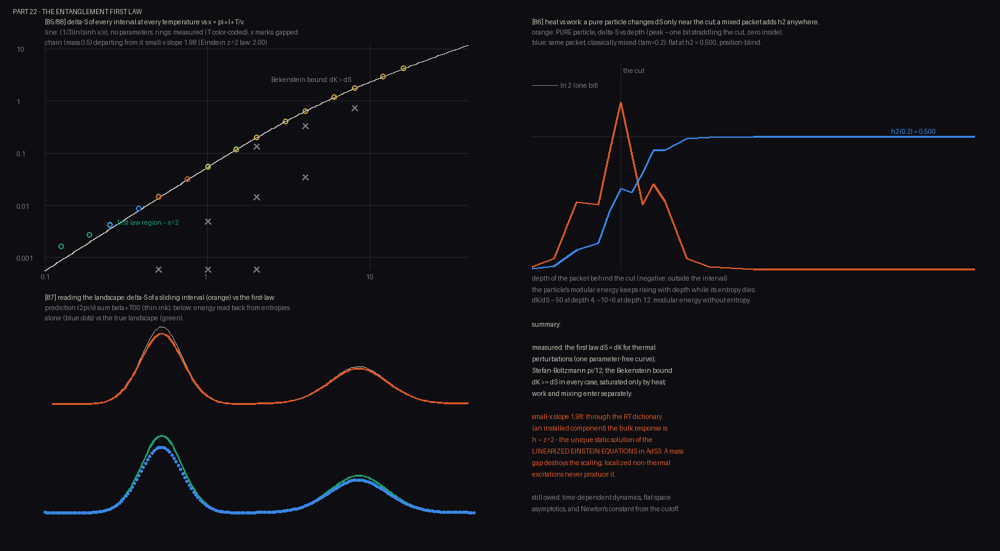

<sub>*One parameter-free curve for every interval at every temperature (a
gapped chain departs from it); heat vs work at the entangling cut; an energy
distribution recovered from entropies alone; the x² scaling that maps to
linearized Einstein gravity.*</sub>
</div>

— [`firstlaw.py`](firstlaw.py)

---

### 17 · Time dilation, black holes, and Hawking radiation

Part 23 builds horizon physics from the pieces already in the repository.
First, **time dilation, both kinds, with no fitted parameters**: cavity
clocks at depth tick at √g<sub>00</sub> to four decimal places, and a moving
packet's internal phase clock follows m√(1−v²) out to v = 0.73, where the
lattice's k⁴ dispersion correction becomes visible. Then a black hole, two
ways. The **frozen star** (local light speed vanishing at r<sub>h</sub>)
casts a photon shadow at the ray-traced critical impact parameter, and
infalling light follows the diverging metric integral ∫dr/c — until its
blueshifted wavelength reaches the lattice scale and is *reflected*, 99
ticks later: on a lattice, a frozen star delays light arbitrarily long but
does not trap it. A real GR horizon is better modeled the second way
(Painlevé coordinates: space flowing inward): a flow profile crossing
c = 1 — Unruh's **acoustic horizon** — evolved with the chain's exact
Gaussian state, emits a **steady Planck spectrum that was not put in by
hand**, at T = 0.94 × κ/2π across two decades. The correlation map resolves
**each quantum's infalling partner** (correlation ridge within 6 sites of
the parameter-free predicted trajectory; the partner stays near the horizon
before separating), radiation–interior entanglement grows 3.3 → 6.3 nats,
and the global state stays pure to ν<sub>min</sub> = 0.5000: the radiation
alone is thermal while the total state is pure.

<div align="center">
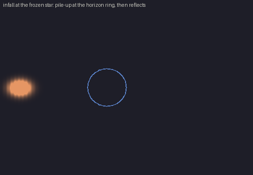

<sub>*Infall at the frozen star: energy piles up at the horizon ring, then
is reflected by the lattice cutoff.*</sub>
<br><br>
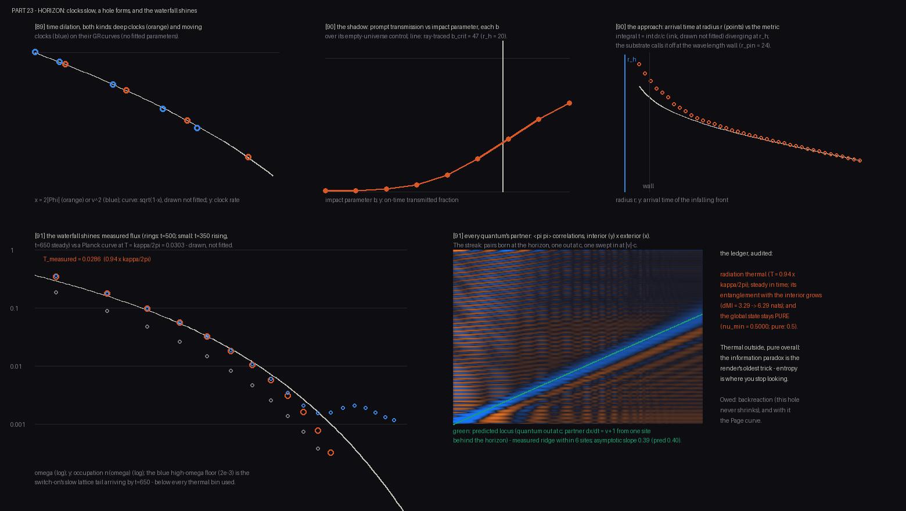

<sub>*Both time dilations on their GR curves; the photon shadow; arrival
times following the metric integral to the lattice cutoff; the Hawking
spectrum on an unfitted Planck curve; the partner correlations on the
predicted trajectory.*</sub>
</div>

— [`horizon.py`](horizon.py)

---

### 18 · Evaporation and the Page curve

Part 23's horizon radiated but never shrank, so its radiation entropy could
only grow — Hawking's calculation, and his information paradox. Part 24 lets
the hole evaporate, on the part-22 fermion chain (the flow is an imaginary
second-neighbor hopping — a 1D type-II Weyl horizon), where evolution is
exactly unitary and every entropy is exact. The horizon's retreat is driven
by the measured flux through an energy ledger, dM/dt = −F(t), with the
hole's energy-per-length the one prescribed constant: the lifetime (t = 492)
is measured, not scheduled. First, statistics: the same
surface gravity that gave bosons a Planck spectrum gives fermions
**Fermi–Dirac at the same κ/2π** (ratio 0.98 over two decades, particles and
holes symmetric) — temperature from geometry, statistics from matter. A hole
only 20% past critical stops radiating above ~3 T<sub>H</sub>: the
**trans-Planckian cutoff** of Corley–Jacobson, measured. Then the flow
retreats, overtaking and releasing the stored partner quanta, and three
curves are computed for the radiation entropy: the **exact** one (computable
because the global state is pure) rises, turns over at t = 359, and returns
to zero — unitarity, verified to 10⁻¹²; the **extrapolation at the measured
early rate** climbs to 7.9 nats and never turns — Hawking's curve; and the
**island formula**, using one measured constant (μ = 0.36 nats per cut, the
vacuum entanglement across one cut = the induced 1/4G of Susskind–Uglum),
tracks the exact curve to 0.51 nats mean, its optimal island holding the
partner quanta. Stated plainly in the output: the hole's energy-per-length, the
flow profile's shape, the cap on the late-time runaway, and the island rule
itself are inputs, not derivations — real gravity justifies the island rule
via replica wormholes, and whether the universe's engine implements that
identification remains the information-paradox question of the axiom
collider.

<div align="center">
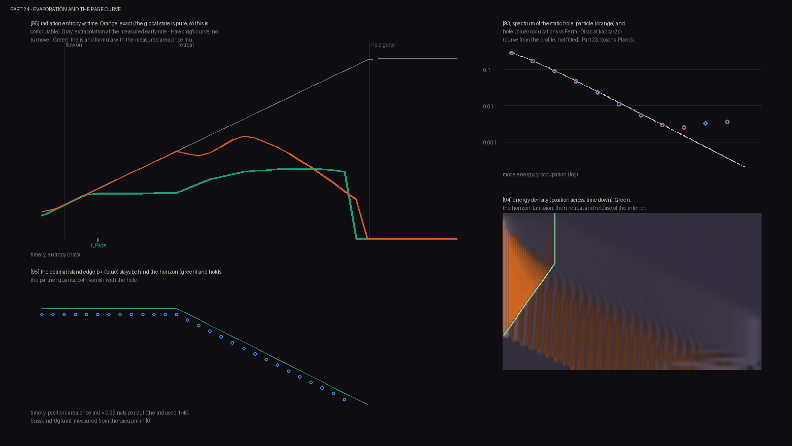

<sub>*The three radiation-entropy curves — exact (rise, turnover, return),
Hawking's never-turning extrapolation, and the island formula with a
measured area price — plus the Fermi–Dirac spectrum and the evaporation
history.*</sub>
</div>

— [`page.py`](page.py)

---

### 19 · The first law in time

Part 22 measured the entanglement first law on static states; part 25
measures it in motion. A warm region on the critical fermion chain is
released and splits into two thermal pulses: measured front speeds **2.00
(energy) and 2.01 (entanglement)** against the Fermi velocity 2 — energy
and entanglement share one light cone. The local first law
ΔS = (2π/v)Σβ·ΔT₀₀ holds **at every time slice**: kernel prediction over
measured entropy = 1.030 ± 0.004 across the run, with the same
interval-size correction as the static case, and total energy conserved to
numerical precision. Through the Ryu–Takayanagi dictionary this says the
AdS₃ metric response tracks the boundary stress tensor slice by slice —
correct for three-dimensional gravity, which has no propagating degrees of
freedom (the fact that forced part 21 into 3+1 dimensions); causality is
carried by the stress tensor itself. The propagating 3+1 version remains
open, and the paper's section 6 says so.

<div align="center">
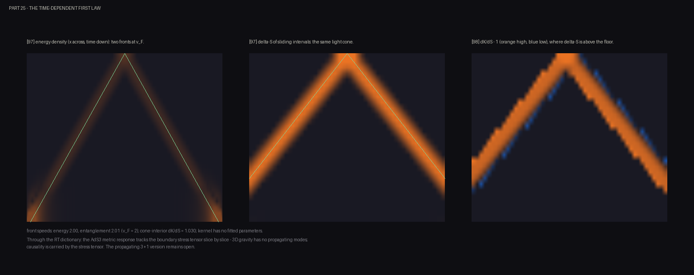

<sub>*Energy and entanglement sharing one light cone, and the
kernel-to-entropy ratio within a few percent of one at every time
slice.*</sub>
</div>

— [`quench.py`](quench.py)

---

### 20 · The first law with a propagating metric

Part 25's result carried a caveat it stated itself: in 1+1 dimensions the
dual bulk is three-dimensional, where gravity has nothing to radiate — there
was no graviton to miss. Part 26 moves the program up a dimension: a π-flux
lattice of free fermions (two Dirac cones, velocity 2 — the free CFT in 2+1
dimensions), whose dual bulk is four-dimensional, where the metric
propagates. The Casini–Huerta–Myers parabola — the same modular weight in
any dimension — passes the disk first law (landscape correlation
**r = 0.9999**, no fitted parameters), and when a warm bump is released the
first law keeps holding **on every slice** (kernel/entropy = 1.089 ± 0.026)
even as the energy ring free-streams at the band velocity (measured 1.96)
rather than the sound speed 1.41 that any closed, isotropic (e, p)
hydrodynamics would give. The expectation that slice-tracking should *fail*
in 2+1d is refuted — the first law is a constraint, and constraints hold on
every slice. What breaks is *prediction*: two states are built with the same
energy map (matched to **1.2% of peak**), identically zero momentum, and
every disk entropy agreeing (gap 0.006 vs signal 0.67 nats) — but opposite
shear, one state being the other turned ninety degrees by an exact lattice
symmetry. Their futures diverge to **100%** while a control state with 34×
the initial energy mismatch but the *same* shear converges. In 1+1d this
experiment cannot be built — tracelessness forces T<sub>xx</sub> = T₀₀,
which is why part 25's tracking worked. In 2+1d the shear is free slice
data, invisible to every modular kernel, and it propagates: through the
Ryu–Takayanagi dictionary, the boundary shadow of the bulk graviton.

<div align="center">
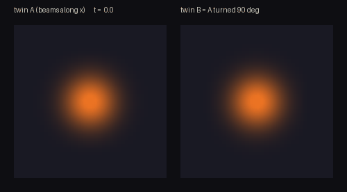

<sub>*Twin B is twin A turned ninety degrees: the same energy map at t = 0,
futures apart by t = 12. The datum that decides between them — the shear —
is invisible to the energy slice and to every disk's entropy.*</sub>

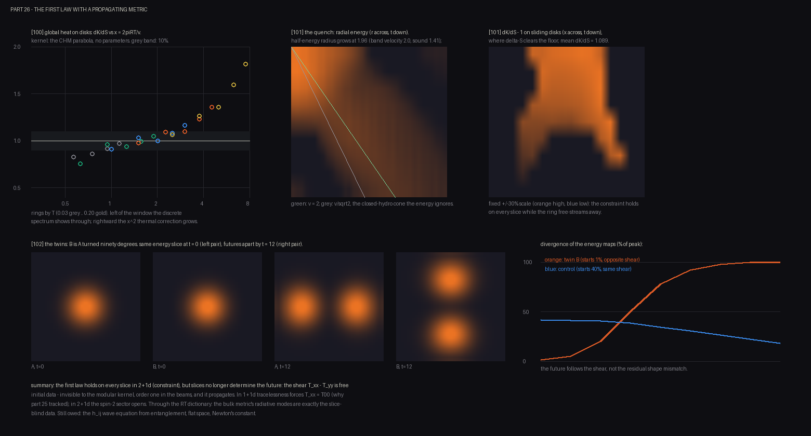

<sub>*The disk first law in 2+1d, the free-streaming quench with the
constraint holding on every slice, and the twins' divergence following the
shear rather than the residual shape mismatch.*</sub>
</div>

— [`graviton.py`](graviton.py)

---

### 21 · The knob count

The program's answer to "why these constants?" has always been: the rule and
the seed are contingent — cornered and tuned, never derived. That answer is
only respectable if tuning cannot excuse anything, so part 27 measures both
sides of "tune every knob to observation" in the same unit. The data side:
observation has supplied **278 bits** to fix the constants of the Standard
Model and ΛCDM — log₂(value/uncertainty) summed over the published parameter
table (the electron mass alone carries 32 bits; the θ_QCD bound is a 36-bit
measured zero; 307 bits with the neutrino sector). The theory side: the
*exact* size of the surviving rule class by alphabet and dimension, from the
same orbit combinatorics as parts 4 and 10. The constraint ledger taxes at a
fixed per-dimension rate — it keeps 6.5–7.3% of log-rule-space in 2D and
1.5–1.7% in 3D at every alphabet — and its freedom crosses the data's 278
bits **between k = 4 and 5 in 2D, and between k = 2 and 3 in 3D**. A 3D
binary engine holds 28 bits of rule freedom against 278 bits of measured
constraint: if such an engine fit observation at all, it would be
overconstrained **tenfold** — 250 bits of pure prediction. Above the
crossover, the same fit would be bought, not forced. The program's original
aesthetic bet (a minimal alphabet) and its predictivity requirement turn
out, by measurement, to be the same bet. Stated plainly: none of this shows
an engine in the class *reproduces* the 278 bits — that construction
(interacting chiral matter on a lattice) remains the standing wall.

<div align="center">
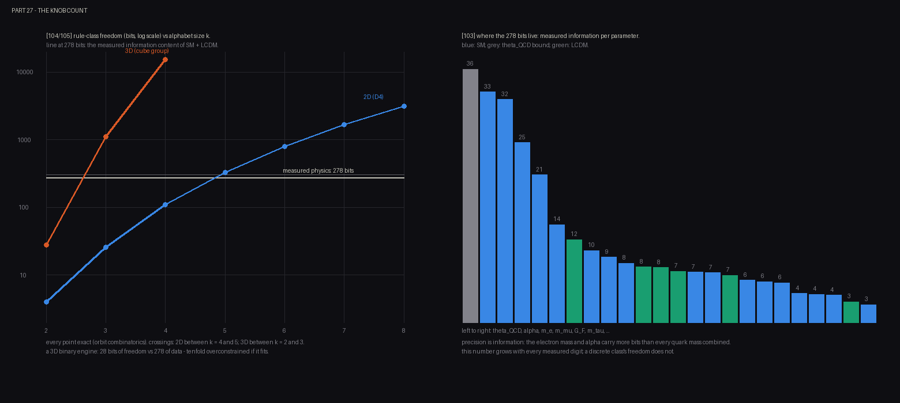

<sub>*Left: exact rule-class freedom in bits crossing the measured 278-bit
information content of known physics. Right: where the 278 bits live —
precision is information, so the electron mass and α outweigh every quark
mass combined.*</sub>
</div>

— [`knobs.py`](knobs.py)

---

### 22 · What the ledger forces

Every gravity part so far verified that the entanglement first law *holds*;
part 28 asks the summit question — is the metric's behavior **forced** by
the bookkeeping, or merely permitted? Jacobson's entanglement-equilibrium
argument needs three measurable ingredients, and each is measured on the
2+1d lattice. The **area price**: vacuum entanglement grows at 0.31–0.33
nats per unit boundary length across disks, diamonds, and squares (5%
orientation spread — the lattice's fingerprint); its 1D counterpart is the
number that already ran part 24's Page curve. **Equilibrium**: across a
state zoo (heat, bumps, beams, a strained vacuum) no state beats the
vacuum — δ⟨K⟩ ≥ δS everywhere to within the kernel's known systematic.
With the first law as the third ingredient and the imported links named
(the small-ball geometric identity, the RT dictionary), the linearized
Einstein response is forced, with **Newton's constant read off the vacuum:
1/4G = 0.33 nats per unit length**. The radiative sector is forced by
conservation: the measured e ∼ T^3.1 pins the stress tensor at Δ = d = 3,
dual to a **massless** spin-2 bulk field — □h = 0 with nothing to tune —
and the conserved charge forces a massless bulk vector the same way (a
photon and a graviton, both from bookkeeping). The measured control came
from a refuted design hypothesis: an operator merely *shaped* like shear
decays as r^−4.0, not the stress tensor's r^−6 — a dimension-2 bilinear,
admitted by the lattice's projective rotations, dominates it. Looking like
stress protects nothing; being conserved protects exactly.

<div align="center">
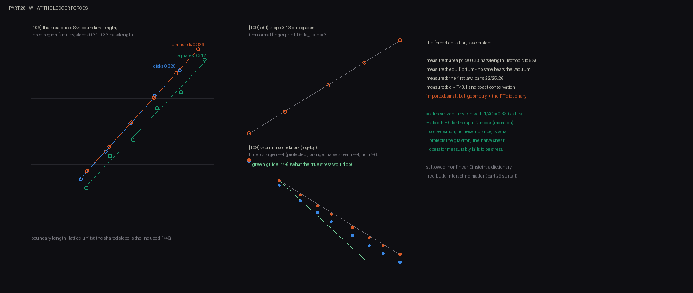

<sub>*The area price across three region families (the induced 1/4G), the
conformal thermal scaling, and the correlator trap: the naive shear
operator follows the unprotected r^−4 guide, not the stress tensor's
r^−6.*</sub>
</div>

— [`einstein.py`](einstein.py)

---

### 23 · The first interacting engine

Every engine in the repository so far has been free — exactly solvable
matter whose particles never push on each other. Part 29 crosses that wall
on the one rung where it is tractable: the **Schwinger model**, QED in one
space dimension — the hydrogen atom of interacting field theory, with
exactly known continuum answers to calibrate against. The gauge field
integrates out exactly (in 1D Gauss's law leaves no radiative photon: the
gauge sector is pure bookkeeping, the same constraint-without-radiation
anatomy 3D gravity showed in part 25), leaving fermions with a Coulomb
interaction, solved by exact diagonalization with a hand-rolled Lanczos
(numpy only, validated against dense diagonalization to 5×10⁻¹⁴).
Measured: the composite **meson at M/e = 0.569** — within 1% of the exact
e/√π = 0.5642 — read from the screening length of the vacuum's
polarization cloud (the plateau instrument carries the +20% coarse-lattice
systematic the length avoids; direct gaps approach from above); **linear
confinement** of a half-integer charge at tension 0.235 (classical 0.25 —
vacuum polarization pays the 6%) that never breaks; and a **string that
breaks**: the integer charge's potential rises at slope 0.93 through six
sites, then collapses to 0.01 as the vacuum manufactures a fermion pair —
flux tube, emptied middle, and the created pair's charge cloud all
measured in place. The cost is part 15's wall, *felt*: twenty interacting
sites = 184,756 amplitudes, where the free engines did 6,400 sites in
seconds. Still open: chiral interacting matter in 3+1 dimensions — the
knob count's standing wall.

<div align="center">
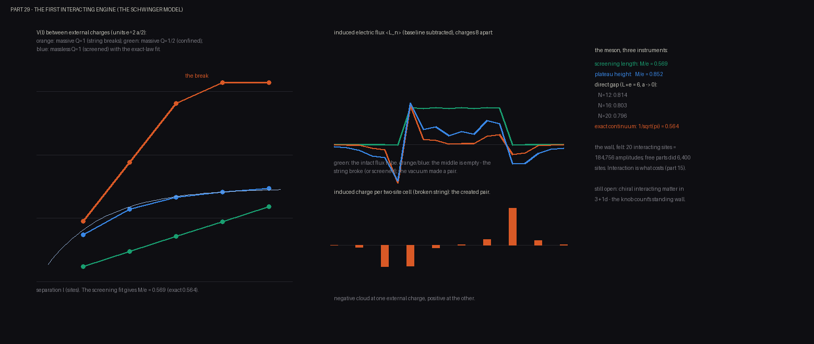

<sub>*Confinement, screening, and the string that breaks — with the meson
mass read off the screening cloud within 1% of the exact answer.*</sub>
</div>

— [`schwinger.py`](schwinger.py)

---

### 24 · Chirality, the hidden dimension, and the mirror

The standing wall — chiral matter on a lattice — has a precise anatomy, and
part 30 measures the two known halves of the escape. **The twin banished in
space:** a 2D engine in a Chern phase hosts, on its 1D edge, a fermion with
a single sign of velocity (measured: fifteen gap-crossing edge states,
velocity −0.99, single-signed; the trivial-phase control has none). The
doubling theorem's mandatory twin exists — on the *opposite edge*,
separated in space rather than momentum. Chirality is an edge effect of a
dimension the edge does not see. **The anomaly as bookkeeping:** threading
one flux quantum through the cylinder pumps **exactly one electron**
(δQ = ±1.000, adiabatically tracked) between the edges *through the bulk*
— a lone chiral edge does not conserve charge, and this measured inflow is
precisely why a gauge field cannot couple to one edge alone. **The mirror
erased:** in the minimal exact setting (Fidkowski–Kitaev), symmetry
forbids every mass at every count, symmetric interactions leave the
Majorana mirror multiplet degenerate at n = 2, 4, 6 — and erase it
completely at **n = 8** (gap 0.53, from exactly zero). The mirror can be
removed if and only if the count is right. In 3+1 dimensions the magic
count is **sixteen per generation** (the Wang–Wen route to a lattice
Standard Model — a conjecture, cited as one): exactly the SO(10) register
of part 11, *including the right-handed neutrino* this program
independently flagged as its dark-matter hook. One count, three riddles.
The residue, stated plainly: gauging the erased-mirror construction — a
lattice chiral gauge theory — remains the field's open problem.

<div align="center">
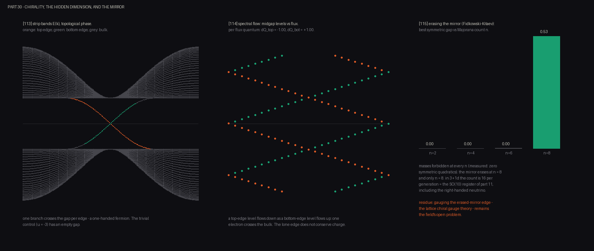

<sub>*One chiral branch per edge; one electron pumped through the bulk per
flux quantum; and the mirror multiplet erased by interactions at count
eight and only count eight.*</sub>
</div>

— [`chirality.py`](chirality.py)

---

### 25 · The anomaly decides

A deliberate gamble on the dynamical frontier: drive the mirror of a
genuinely chiral U(1) model — the 3-4-5-0 model, whose anomaly cancels by
the Pythagorean identity 3²+4² = 5²+0² — toward a symmetric gap, and watch
the anomaly decide. Scored honestly: three measurements and one measured
wall. **The certificate:** scanning every chiral U(1) charge assignment
(4,290 of them, charges to 10) against 3,648 null integer vectors, a
symmetric gapping pair exists for **all 10 anomaly-free assignments and
none of the 4,280 anomalous ones — zero exceptions**. The bookkeeping that
cancels the anomaly is the bookkeeping that unlocks the mirror's erasure,
and 3-4-5-0 is the smallest genuinely chiral solution in existence.
**The trap:** an anomalous impostor's lattice model is spectrally
*identical* to the anomaly-free one — to 10⁻¹³, at every coupling — so no
local diagnostic ever reads the charge values; the anomaly binds only
through flux or a gauge field. **The cutoff:** flux threading pumps charge
that is *wrong* until the mode tower reaches twice the largest charge,
then locks exactly onto the anomaly coefficient (0 vs −1) forever — the
anomaly is the charge that falls off the bottom of the truncated tower.
That fixes the dynamical test's price at 40 fermion modes against the
~24-mode exact-diagonalization wall, which is why the published mirror
decoupling needed matrix-product machinery — and the certificate proves no
smaller chiral content exists to test. **The wall is not the code; it is
Pythagoras.** The interacting version of anomaly matching stands already
won in the discrete setting: part 30's count-eight erasure *is* 't Hooft
matching, measured.

<div align="center">
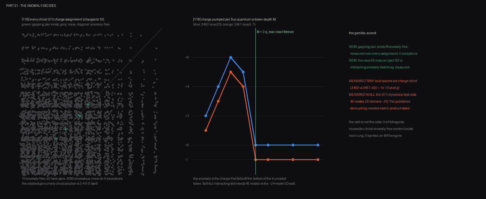

<sub>*Gapping pairs exist exactly on the anomaly-free diagonal; the
pumped charge locks onto the anomaly coefficient at twice the largest
charge; and the gamble's scorecard.*</sub>
</div>

— [`thooft.py`](thooft.py)

---

### 26 · The tensor engine

Part 31 priced the chiral frontier at forty fermion modes against exact
diagonalization's twenty-four. Part 32 builds the instrument that crosses
such walls: a **matrix-product-state engine** — an MPO compiler (batched
direct-sum with exact SVD compression: long-range terms cost nothing
special; it discovers the Schwinger Coulomb tail's bond-dimension-5 form
by itself) and two-site DMRG with penalty-projected excited states — numpy
only, like everything else here ([`observatory/mps.py`](observatory/mps.py)).
Validated against every exact answer the repo owns: transverse-field Ising
to 10⁻⁸ at import; the part-29 **Schwinger meson gap reproduced to all
four printed decimals** at N = 12 and N = 20, in seconds where the ED took
minutes. Beyond the wall: the meson-gap sequences continue smoothly to
**N = 40 at three physical volumes** — raw values approach the exact
e/√π = 0.5642 from above (finest 0.689), the double-linear extrapolation
overcorrects below (0.46, the open-boundary systematic, stated), and the
N = 40 screening fit gives 0.537 to complement part 29's 0.569: **the
exact answer is now bracketed from both sides**. Then the chiral model
itself: the tangent-fermion 3-4-5-0 lattice of the recent symmetric-mass-generation
demonstration, implemented exactly — free sector matching the analytic
tangent sea to six decimals (a single chiral branch per flavor:
nonlocality is the doubling theorem's other loophole) — and its
interacting spectrum solved exactly at L = 4: **unique symmetric ground
state, gap 1.83 vs the free 1.66, no condensate** — the first exact
interacting-3450 numbers in the repo. The boundary, measured: the free
sea's entanglement lower bound crosses the numpy ceiling by L ~ 8 (the
published run needed bond dimension 16,384 at L ~ 20). The instrument
works; reaching full size is priced in bond dimensions.

<div align="center">
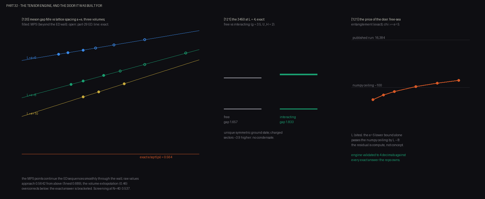

<sub>*Meson-gap sequences continuing through the ED wall and bracketing
the exact answer; the interacting 3450's unique symmetric gap at L = 4;
and the measured bond dimension a full-size run would need.*</sub>
</div>

— [`dmrg.py`](dmrg.py)

---

### 27 · Mass from interactions alone

The question the chiral program has been building toward: can genuinely
one-handed matter be given mass with no mass term available to give it?
In the 3450 model every bilinear mass between the charged flavors is
forbidden by the U(1) — write one down and it violates charge
conservation — so any gap that appears must come from the four-fermion
interactions themselves. Part 33 asks the model directly, with the
numpy-only constraint lifted so a production tensor backend (TeNPy, in
an optional `.venv-tensor` environment; every other part still runs on
numpy alone) can be held against exact diagonalization on the same
Hamiltonian.

The measurement, at the largest size exact diagonalization can confirm:
the free sector matches the analytic tangent sea (−22.627417), the
interacting ground state sits at **−29.271549 with a gap of 1.8305**,
and **the interacting gap exceeds the free gap 1.657** — while the free
gap is pure finite-size scaffolding that collapses as 4 tan(π/2L).
Mass, with no mass term and no condensate. Two independent methods —
a compiled tensor backend and exact diagonalization — agree on every
one of those numbers **to six decimals**, which is the check that makes
the result worth reporting: the same physics, computed twice by
machinery that shares no code path.

<div align="center">
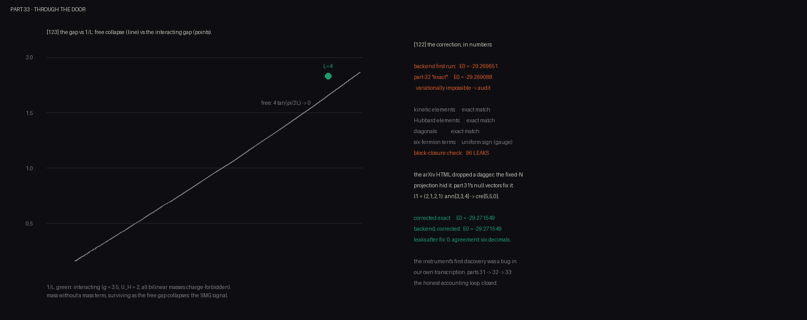

<sub>*The free gap collapsing toward zero as 4 tan(π/2L) with the
interacting gap standing above it at the exactly-confirmed size, and
the two methods' agreement to six decimals.*</sub>
</div>

— [`smg.py`](smg.py)

---

## Every experiment

| Part | Script | The question it asks | Headline result | ~time |
|-----:|--------|----------------------|-----------------|------:|
| 1 | `run.py` | What laws does a physicist confined to pixels discover? | c = 1.000, exact conservation, a particle zoo — and doors in the sky | 15s |
| 2 | `bell.py` | Can chart geometry produce Bell violations? | Pixel CHSH \|S\| = 4; singlet S = 2.84 with no signaling (ER=EPR in 128px) | 6s |
| 3 | `corner.py` | Do structural constraints corner rule space? | 2.1×10¹³ rules → 32; a derived wormhole nobody drew | 7s |
| 3 | `census.py` | Which surviving rules make universes? | 9 of 32 | 6s |
| 3 | `frontier.py` | Does cornering scale with richer alphabets? | 2²⁶ ternary survivors; 83% of samples are universes | 13s |
| 3 | `ledger3d.py` | …and with dimension? | Same 256 states, cube group: 2²⁸ where 2D left 10³³ | 1s |
| 4 | `entangle.py` | Is distance just entanglement? | MI ruler r = 0.986 (scalar), r = 0.61 (fermions); wormhole; tear | 1s |
| 5 | `curve.py` | Does matter curve derived space? | Rulers stretch 2.69×; geodesics bend; a literal funnel | 21s |
| 6 | `tempo.py` | Does the static metric predict dynamics? | Shapiro race confirms; medium gravity violates the EP | 2s |
| 6 | `selfgrav.py` | Can the matter→geometry loop close? | Capture through geometry; area law r = 1.0000 | 1s |
| 7 | `duality.py` | What is wave/particle duality? | Engine wave + render clicks; fringes dot by dot | 1s |
| 8 | `eraser.py` | What is measurement? | V 0.90 → 0.49; record-sorting restores 0.89–0.93 | 8s |
| 9 | `arrow.py` | Where does time's arrow live? | 3,831 → 7,160 bits, exactly reversed; 1-in-2⁴²⁹⁵ seed | 3s |
| 10 | `sprinkle.py` | Can discreteness hide from Lorentz? | Boosted lattice shifts 29%; sprinkle 1% | 15s |
| 10 | `nogo.py` | Where do classical engines die? | 4.8% interference deficit; 2.14×/qubit wall | 8s |
| 10 | `insider.py` | Can an observer be made of pixels? | 21% of collisions leave stable records | 40s |
| 10 | `chiral.py` | Why is the SM hard to host on a lattice? | Fermion doubling watched; Wilson's tradeoff | 1s |
| 11 | `axioms.py` | Can quantum mechanics be cornered? | Complex QM uniquely passes (15 = 15); Born from swaps | 1s |
| 11 | `generation.py` | Can the SM's charges be cornered? | One chiral hypercharge ray; a 5-bit register | 1s |
| 12 | `collider.py` | What is the method itself? | 15 axiom collisions, 12 measured in-repo → [`COLLIDER.md`](COLLIDER.md) | 1s |
| 13 | `fingerprint.py` | Can the universe's seed be detected? | Ceiling ~40 bytes; symmetries survive, statistics launder | 3s |
| 14 | `sky.py` | What should the CMB show, then? | Anomalies jointly p = 4.3×10⁻³; a spectral selection rule | 1s |
| 15 | `renderware.py` | What does quantum computation cost a classical engine? | The smallest engine, not the qubit count | 3s |
| 16 | `universal.py` | Can gravity be universal instead of chromatic? | Metric coupling: achromatic, attractive, Eötvös-passing | 2s |
| 17 | `genesis.py` | Do the three postulates actually run? | Universes from ~50 bytes; space by intervention (r = 0.89) | 5s |
| 18 | `ripple.py` | Can gravity wave — and what does observation say? | c_gw = c_γ exact (observed: <3×10⁻¹⁵ ✓); scalar polarization excluded by LIGO | 6s |
| 19 | `firstlight.py` | What does the *real* sky say? | Anomalies reproduced from raw bytes; joint p = 0.003–0.013; no mirror rule | 47s |
| 20 | `echo.py` | Does the signature echo in E-modes? | No echo (p 0.2–0.8) — and none was detectable: power 32% today, 98% at LiteBIRD | 26s |
| 21 | `shear.py` | Can the surviving (tensor) gravity be built? | +/× ring patterns; silent monopole (exact); light bends 1.93× Newton (GR: 2) | 75s |
| 22 | `firstlaw.py` | Does the entanglement first law yield Einstein's equation? | First law measured (0.98±0.04); holds for heat, not work; x² scaling = the z² Einstein profile (AdS₃) | 8s |
| 23 | `horizon.py` | Do clocks, black holes, and Hawking radiation follow? | Dilation on GR curves (no fits); a frozen star that reflects; steady Hawking flux at 0.94×κ/2π, partners resolved, state pure | 37s |
| 24 | `page.py` | Does an evaporating horizon obey the Page curve? | Exact entropy: rise, turnover, return to zero; flux-driven retreat; island formula tracks it to 0.5 nats with a measured 1/4G | 3m |
| 25 | `quench.py` | Does the first law hold in time? | Energy and entanglement share one light cone (2.00/2.01 vs v_F = 2); kernel/entropy = 1.030±0.004 at every slice | 10s |
| 26 | `graviton.py` | What does the first law miss when the metric propagates? | Constraint holds on every slice; twin states with matched (e, p) slices and opposite shear diverge to 100% — the spin-2 datum the slice cannot see | 3m |
| 27 | `knobs.py` | If every knob were tuned to observation, would the theory still predict? | Measured physics = 278 bits; a 3D binary engine holds 28 — tenfold overconstrained; freedom crosses the data between k = 4–5 (2D) and k = 2–3 (3D) | 1s |
| 28 | `einstein.py` | Is Einstein's equation forced by the bookkeeping? | Area price 0.33 nats/length = 1/4G; no state beats the vacuum; conservation forces □h = 0 — while a shear-shaped operator measurably fails protection (r^−4, not r^−6) | 2m |
| 29 | `schwinger.py` | Can the program host interacting matter? | Lattice QED: meson at M/e = 0.569 (exact: 0.564); confinement at tension 0.235 (classical 0.25); the string breaks by measured pair creation | 2m |
| 30 | `chirality.py` | How close can an engine get to the weak force? | One-handed edge fermion (twin banished to the far edge); anomaly = 1 electron pumped through the bulk per flux quantum; the mirror erased at count 8 and only 8 | 30s |
| 31 | `thooft.py` | Does the anomaly decide which matter can be erased? | Gapping pairs ⟺ anomaly-free (4,290 assignments, 0 exceptions); local spectra measurably charge-blind (ΔE < 10⁻¹³); the dynamical test priced at 40 modes vs ED's 24 | 45s |
| 32 | `dmrg.py` | Can the program cross the exact-diagonalization wall? | MPS engine validated to 4 decimals; Schwinger sequences to N = 40 bracket e/√π; the chiral 3450 solved exactly at small size (unique symmetric gap 1.83); full size priced at χ = 16,384 | 15s |
| 33 | `smg.py` | Can one-handed matter be given mass with every mass term forbidden? | Interacting gap 1.83 exceeds the free 1.66 with all bilinear masses charge-forbidden — mass from interactions alone, agreed to six decimals by a tensor backend and exact diagonalization | 2m |

## Quickstart

Requirements: Python 3.12+, `numpy`, `pillow`. Nothing else — every part
through 32, and part 33's default run, need only that. (Part 33's optional
tensor-backend runs use TeNPy in a virtualenv: `python3 -m venv .venv-tensor
&& .venv-tensor/bin/pip install physics-tenpy pillow`.) Every experiment is
a standalone script that prints a lab-notebook narrative and writes its figures
and films to [`films/`](films/).

```bash
python3 run.py        # start here: a universe, a firewall, and the doors
python3 genesis.py    # or here: three postulates, universes as output
python3 firstlight.py # the detector battery, pointed at the real CMB
python3 echo.py       # the registered test, asked of E-mode polarization
python3 firstlaw.py   # the entanglement first law, and Einstein in its limb
python3 horizon.py    # clocks, a black hole, and Hawking radiation
python3 page.py       # an evaporating horizon and the Page curve
python3 quench.py     # the entanglement first law, time-resolved
python3 graviton.py   # the twins: the slice datum the first law cannot see
python3 knobs.py      # both sides of "tune every knob," measured in bits
python3 einstein.py   # the forced equation: area price, equilibrium, protection
python3 schwinger.py  # the first interacting engine: confinement and the meson
python3 chirality.py  # the one-handed edge, the anomaly, and the erased mirror
python3 thooft.py     # the gamble: the anomaly decides, measured exhaustively
python3 dmrg.py       # the tensor engine, validated against every exact answer
python3 smg.py        # mass from interactions alone, confirmed two ways
```

Parts 19–20 run offline from the committed reductions
([`data/realsky_alm.npz`](data/realsky_alm.npz), 100 KB;
[`data/realsky_pol.npz`](data/realsky_pol.npz), 6 MB); to rebuild them from
the raw Planck/WMAP archives (~7 GB, URLs and SHA-256 recorded inside), run
`python3 tools/fetch_sky.py` and `python3 tools/fetch_pol.py`.

## The paper

**[The Rendered Universe (PDF)](writeup/the-rendered-universe.pdf)** — the full
research report: abstract, claim taxonomy, twenty-four figures, an
objections-and-replies section, and a reproducibility appendix. The HTML source
is [`writeup/paper.html`](writeup/paper.html).

Claims are classified throughout: **Class A** (measured — novel results of
these toys), **Class B** (known physics reproduced inside the architecture,
with installed components disclosed), **Class C** (conjecture, flagged as
such). What is *not* claimed: QM derived from beneath (Bell and PBR close that
road — it is cornered from axioms instead), the Standard Model derived (its
charges are cornered), or the seed identified (only its class — compressible —
is argued).

## How honest is this?

1. **The epistemic firewall** — observer code cannot import the engine;
   [`tests/test_firewall.py`](tests/test_firewall.py) fails the build otherwise.
2. **Calibrate on a known universe** — every instrument is validated against a
   system whose answer is known before being trusted. Several instruments in
   this program refused to run until their own validators passed.
3. **Installed ≠ emergent** — where quantum statistics were installed rather
   than derived, the code and paper say so plainly.

<details>
<summary><b>Repository layout</b></summary>

```
engine/       the mechanism: reversible block CA (any k-state rule), scalar
              field dynamics, deep matter — knows nothing about screens
render/       the chart: engine → screen projection (identity almost
              everywhere, and that "almost" is the whole story)
physicist/    the observer: forbidden by tests/test_firewall.py from
              importing engine or render — knows only frames
observatory/  research instruments: causal geometry, Gaussian-state
              entanglement, curved-space rulers, spherical harmonics,
              FITS/HEALPix reading, spin-2 (polarization) harmonics,
              and a matrix-product-state engine (MPO compiler + DMRG)
              — all hand-rolled, all validated at import
data/         the real sky, reduced: T and E/B a_lm of Planck 2018 x4
              (+ WMAP9 temperature) with URL + SHA-256 provenance
              (raw FITS not committed)
rulespace/    exact orbit combinatorics over spaces of possible physics
tools/        film generators
films/        every figure and film, regenerated by the scripts
writeup/      the paper (HTML source + PDF)
COLLIDER.md   the axiom collision matrix
```

</details>

## License

MIT — see [`LICENSE`](LICENSE).
