<div align="center">

# The Rendered Universe

**Twenty-one runnable experiments on one hypothesis: the physical universe is
not a simulation — it is the *render output* of one.**

Particles are pixels. You can observe them and infer the rules of the rendering,
but they are not the mechanical parts of the machine.

<br>

[**Read the paper (PDF)**](writeup/the-rendered-universe.pdf) · [Run the experiments](#quickstart) · [The axiom collider](COLLIDER.md)

<br>

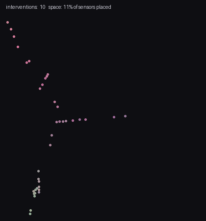

<sub>*The birth of space: a derived map rebuilt as interventional probes accumulate —
filaments, then tendrils, then a coherent 2D sheet. Colors encode the hidden wiring
the renderer was never shown.*</sub>

</div>

---

## The idea, in three layers

- **The engine** — the mechanism: a state and an update rule. It knows nothing
  about observers or display.
- **The chart** — a fixed projection from engine degrees of freedom to observed
  ones. It is a bijection but *not* an isometry: adjacency on the screen need
  not be adjacency in the engine.
- **The render** — the observed layer: particles, fields, spacetime. Observers
  are patterns in the render.

On this reading, quantum nonlocality is a chart artifact, particles are render
events sampled from engine amplitudes, geometry is the shape of the entanglement
pattern, and the arrow of time is a property of coarse render descriptions of a
reversible engine. Every one of those sentences is demonstrated by code in this
repository.

The whole program compresses to three postulates:

> **1.** &nbsp; U is a bijection &nbsp;&nbsp;&nbsp;&nbsp;&nbsp;&nbsp;&nbsp; *(nothing is ever lost)*
>
> **2.** &nbsp; d(x, y) = −log I(x : y) &nbsp; *(nearness is dependence)*
>
> **3.** &nbsp; K(seed) is small &nbsp;&nbsp;&nbsp;&nbsp;&nbsp;&nbsp; *(the beginning is written)*

Part 17 ([`genesis.py`](genesis.py)) is the existence proof that the three lines
*run*: universes from ~50 lofted bytes, with space, dimension, and causal order
derived rather than supplied.

---

## The tour

### 1 · A universe with a firewall

A three-line reversible rule (Critters) plus an observer that is *forbidden by an
automated test* from seeing anything but rendered frames. The pixel-physicist
measures c = 1.000, an exact conservation law, a particle zoo — and two "doors"
in the sky where probes jump at 48× light speed. The doors are the chart's seam:
places where screen adjacency and engine adjacency disagree.

<div align="center">
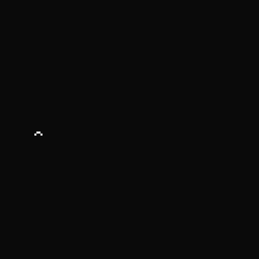

<sub>*A probe particle breaking screen-space locality: it vanishes into one door
and reappears at the other. In the engine, nothing unusual happens at all.*</sub>
</div>

The physicist then *predicts* a hidden adjacency from the door geometry and
confirms it with a timed CHSH game: **|S| = 4 from raw cellular-automaton
dynamics** across screen-causally isolated stations (classical bound: 2), and
singlet statistics S = 2.84 with no signaling when an "entangled" pair is
engine-adjacent. ER=EPR, in 128 pixels. — [`run.py`](run.py) · [`bell.py`](bell.py)

### 2 · Geometry is an output

Version two of the renderer derives space instead of being handed it. From causal
structure: a wired engine shortcut appears in the derived map as a wormhole
nobody drew. From entanglement: a massive scalar field's mutual information
tracks true distance at **r = 0.986** — and the same construction with fermions
gives r = 0.61, because *the derived geometry belongs to the matter, not the
wiring beneath it*.

<div align="center">
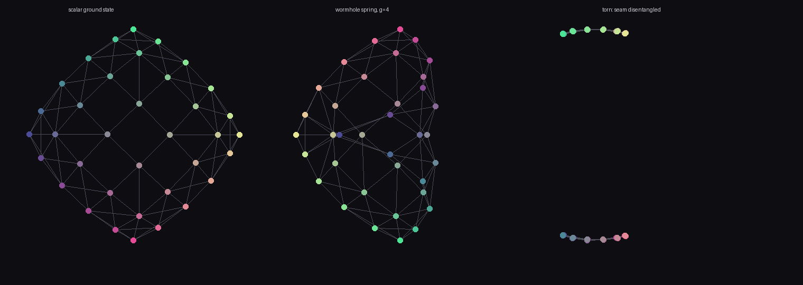

<sub>*Left: the scalar ground state renders a flat sheet. Center: one strong
coupling between far patches folds space — a wormhole, with monogamy visibly
decoupling its mouths. Right: disentangle a seam and space falls into two
islands (Van Raamsdonk's argument, run as an experiment).*</sub>
</div>

Entanglement entropy of regions scales with their **perimeter** (r = 1.0000),
not their area — holography's clue about the engine's data layout, reproduced
exactly. — [`corner.py`](corner.py) · [`entangle.py`](entangle.py) · [`selfgrav.py`](selfgrav.py)

### 3 · Matter curves the metric

Give the field an inhomogeneous vacuum and re-derive the geometry with
vacuum-calibrated rulers: local distance stretches 1.00× → 2.69× where the
matter sits, geodesics bend around the well, and the 3D embedding of derived
space is a literal funnel.

<div align="center">
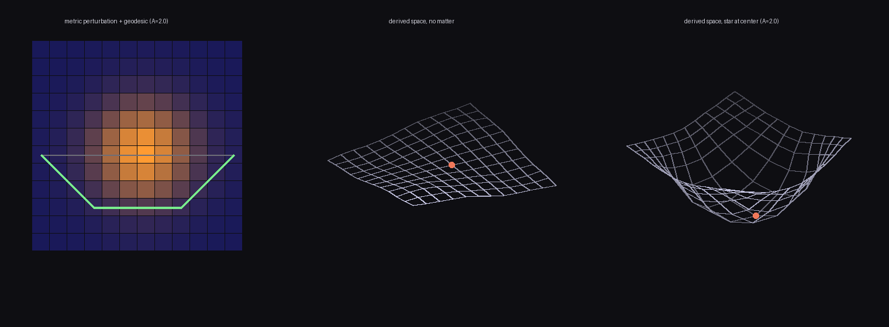

<sub>*Left: the measured metric perturbation tracks the matter, with the
shortest path (green) bending around the well. Right: derived space, embedded —
flat without matter, a funnel with it.*</sub>
</div>

— [`curve.py`](curve.py)

### 4 · Time, and the equivalence-principle discriminator

Wave dynamics on the curved background confirm the static entanglement metric's
time-of-flight predictions (a Shapiro-delay race). But gravity implemented as a
*medium* is chromatic — bend and opacity depend on wavelength — a measured
violation of the equivalence principle. Recoupling through an optical **metric**
repairs it: attraction with the correct lensing sign, achromatic across an
octave, and an Eötvös pass — **different masses at the same velocity fall
within 2.4 cells**, with slow matter falling ~1/v² harder than light, as in GR.

<div align="center">
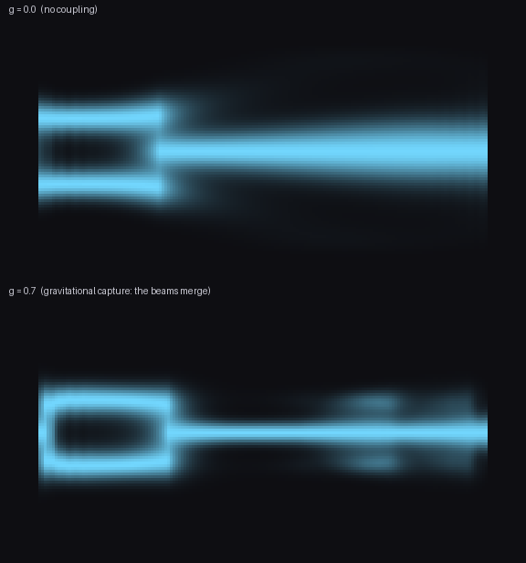

<sub>*Self-gravity: the field sources its own long-range potential. Top: no
coupling, parallel flight. Bottom: the beams fall together and merge —
gravitational capture.*</sub>
</div>

— [`tempo.py`](tempo.py) · [`universal.py`](universal.py)

### 5 · The quantum render layer

Wave/particle duality as architecture: the wave is the engine object, the
particle is the render event. One field passes through both slits; Born-sampled
clicks assemble the fringes dot by dot, Tonomura-style.

<div align="center">
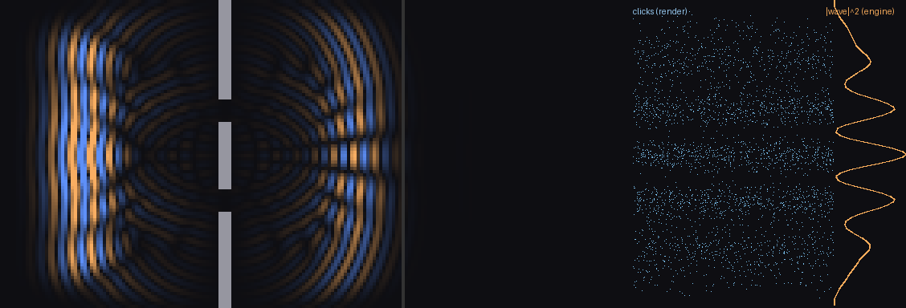

<sub>*Left: the engine's wave interferes through both slits. Right: the
renderer's discrete clicks reproduce |wave|², dot by dot.*</sub>
</div>

What no classical render layer can fake is also measured: both-slit arrivals
fall to **4.8% of the classical P₁+P₂ floor** at the deepest minimum, and the
classical amplitude wall costs ×2.14 per qubit. Measurement is correlation, not
collapse: a which-path detector kills fringe visibility 0.90 → 0.49, and
re-sorting the *same* clicks by the detector's record restores V = 0.89–0.93.
— [`duality.py`](duality.py) · [`nogo.py`](nogo.py) · [`eraser.py`](eraser.py)

### 6 · The arrow of time

The engine is a bijection, so the arrow cannot live in the laws. A matter blob's
coarse-grained entropy climbs 3,831 → ~7,160 bits; exact reversal marches it
back to 3,831 with **bit-perfect recovery of the microstate**; one flipped cell
in the gas destroys the past — while the same flip in vacuum preserves it minus
one cell. Chaos is matter-borne: history is destroyed by interaction, preserved
by isolation. Random states of equal matter count all sit at equilibrium: the
initial blob is one microstate in 2⁴²⁹⁵.

<div align="center">
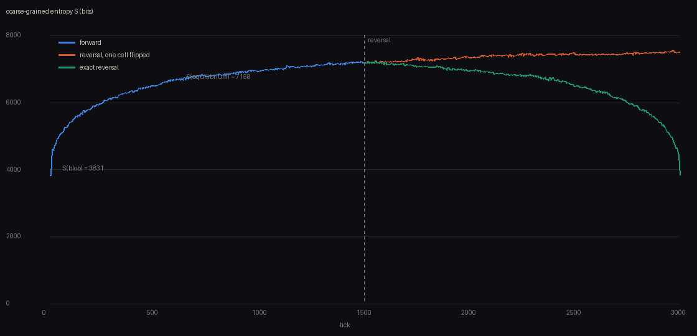
<br><br>
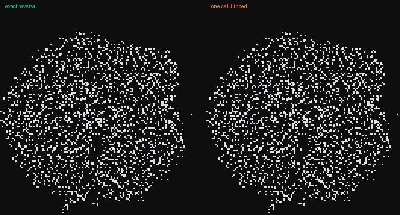

<sub>*Top: entropy rises, retraces exactly under reversal, and clings to
equilibrium when one cell was flipped first. Bottom: the gas un-scrambling into
the original blob — versus failing to, because of a single bit.*</sub>
</div>

— [`arrow.py`](arrow.py)

### 7 · Observers are weather

Colliding a glider with each of 456 bound states across impact parameters:
**21% of 3,192 collisions leave a stable, isolated, changed record** — a 1-bit
detector made of pixels, intact 400+ ticks. Observers require no extra physics.
— [`insider.py`](insider.py)

### 8 · Hiding the lattice

A lattice has grain: 20% systematic light-speed anisotropy, and a boosted
spacetime lattice shifts its statistics by 29% — every observer can measure an
absolute velocity. A Poisson sprinkle has none: boosted statistics shift 1%,
pure noise. Discreteness without a rest frame is possible; it costs noise, and
noise averages away with scale. — [`sprinkle.py`](sprinkle.py) ·
[`chiral.py`](chiral.py) (the fermion-doubling theorem, watched happening)

### 9 · Constraints corner theories

The ledger — reversibility, isotropy, conservation, stable vacuum — deletes
candidate physics by pure combinatorics:

| Rule space | States | Symmetry | Full space | Survivors |
|---|---:|---:|---:|---:|
| 2D, 2-state | 16 | D₄ (8) | 2.1×10¹³ | **32** |
| 2D, 3-state | 81 | D₄ (8) | 10¹²⁰·⁸ | 2²⁶ |
| 2D, 4-state | 256 | D₄ (8) | 10⁵⁰⁶·⁹ | 10³³·¹ |
| 3D, 2-state | 256 | O<sub>h</sub> (48) | 10⁵⁰⁶·⁹ | **2²⁸** |

Same 256 states, cube-group isotropy: twenty-five more orders of magnitude
deleted — *dimension is a constraint multiplier*. Among survivors, universes
are generic (83% of sampled ternary rules make one). The same cornering logic
operates on real physics: anomaly cancellation leaves exactly **one** chiral
hypercharge ray — the Standard Model's — making atoms exactly neutral; one
generation of matter is the sixteen even-parity states of a **five-bit
register**; and the quantum reconstruction axioms leave exactly one probability
theory standing (complex QM, 15 = 15). — [`corner.py`](corner.py) ·
[`frontier.py`](frontier.py) · [`ledger3d.py`](ledger3d.py) ·
[`axioms.py`](axioms.py) · [`generation.py`](generation.py)

### 10 · The prediction

Two measured laws discipline the seed hypothesis: detectability of a seed's
generator dies at ~40 bytes of program, and under chaotic dynamics
*statistical* fingerprints launder completely while **exact seed symmetries
survive forever**. So the observable signature class is symmetry and long-range
alignment, in the earliest accessible layer — the CMB. A calibrated spherical
detector battery shows the three observed low-ℓ anomalies, injected at their
published amplitudes, read individually as ~2σ curiosities but **combine to
p ≈ 4×10⁻³** under the common-origin hypothesis — and an exact seed symmetry
is not a statistic but a spectral selection rule (odd-(ℓ+m) power = 0.000
against a null of 0.5). The prediction is registered in advance for E-mode
polarization. — [`fingerprint.py`](fingerprint.py) · [`sky.py`](sky.py)

<div align="center">
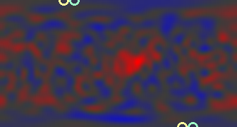

<sub>*A synthetic sky carrying the three observed CMB anomalies at published
amplitudes; rings mark the aligned quadrupole and octupole axes.*</sub>
</div>

A second fork runs independently: a memory-bounded classical engine supports
faithful quantum computation only to **n ≈ log₂(10¹²²) ≈ 400 logical qubits**
in one coherent block — and the bound is on the largest *jointly entangled
block*, not qubit inventory: the render-aware simulator measures independent
machines' exponentials adding (8×10 qubits = 128 KB; fused = 10⁷ EB projected)
and a GHZ-22 costing 248 bytes until a single T gate multiplies the ledger
270,600-fold. — [`renderware.py`](renderware.py)

### 11 · Genesis

The three postulates, run: universes from ~50 bytes, with sites exposed to the
renderer only as shuffled opaque IDs. Finding en route: *watching fails* —
period-locked matter gives distant sensors shared rhythm, and rhythm
masquerades as proximity (r = 0.09). The renderer must **intervene**: flip a
site, time the arrival. Space emerges at dimension 2.2 with the hidden wiring
recovered at r = 0.89. In a deterministic world, space is causation.

<div align="center">
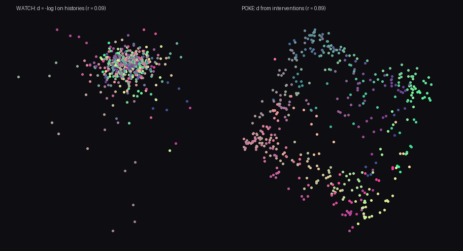

<sub>*The finding in one image: what watching gives you (r = 0.09 hairball)
versus what poking gives you (r = 0.89 sheet). Same universe, same sensors —
the only difference is whether the observer acted.*</sub>
<br><br>
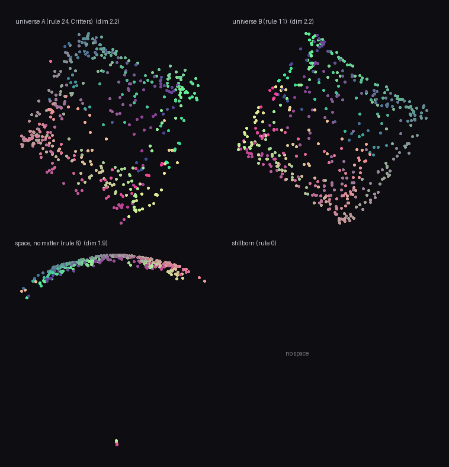

<sub>*Four worlds lofted from the ledger: two universes, one thin fragmented
space, one stillborn.*</sub>
</div>

— [`genesis.py`](genesis.py)

### 12 · First light

Every part so far ran on toy universes. Part 19 points the part-14 detector
battery at the *actual* universe: the four Planck 2018 component-separated CMB
maps and WMAP's 9-year ILC, read from raw FITS bytes by a hand-rolled,
import-validated HEALPix reader ([`observatory/healpix.py`](observatory/healpix.py)
— no astropy, no healpy), against 10,000 Gaussian ΛCDM skies drawn from the
published best-fit spectrum.

The instrument validates on the sky itself: two spacecraft agree multipole by
multipole (r = 0.98), and the literature's numbers come out of our pipeline —
the quadrupole-octupole alignment (8.1°, p = 0.010, axes within 1° of the
published ones), the low quadrupole (198 vs ΛCDM's 1017 µK²), the odd-parity
excess (p ≈ 0.05). Individually: the field's familiar ~2σ curiosities.
**Jointly, under the common-origin hypothesis that part 14 registered: p =
0.003–0.013 across the four Planck maps (~2.5–3σ) — the shape part 14
predicted from injections.** The mirror selection-rule scan — the protected
fingerprint an exact seed symmetry would leave — finds no rule at temperature
(a bound, not a detection), though the preferred mirror axis lands 5° from
the CMB dipole, where Planck's own mirror-parity whispers pointed.

<div align="center">
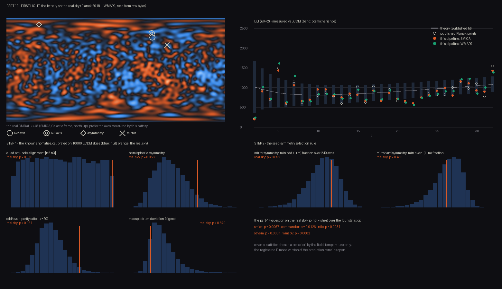

<sub>*The real CMB with the battery's measured axes (the two rings nearly
touching are the aligned quadrupole and octupole), the measured low-ℓ spectrum
against ΛCDM, and every statistic calibrated on 10,000 null skies.*</sub>
</div>

— [`firstlight.py`](firstlight.py) · maps fetched and reduced by
[`tools/fetch_sky.py`](tools/fetch_sky.py) (SHA-256 provenance in
[`data/realsky_alm.npz`](data/realsky_alm.npz))

### 13 · The echo

Registration pays out. Part 19 fixed the axes; part 20 asks polarization the
question. E-modes are a partially independent second draw from the same
primordial modes — if the temperature anomalies are features of the seed, they
must **echo** at those axes; if they are flukes, they vanish. A hand-rolled
spin-2 transform ([`observatory/spin.py`](observatory/spin.py), Wigner-d by
recursion, pinned to reference conventions at import) reads E/B from the raw
Stokes bytes, validating to TE amplitude 0.97–1.00 against ΛCDM across all
four Planck pipelines — and catching a canary en route: *Planck's polarization
inpainting, touching 4% of the sky, eats a third of the large-scale TE
signal.*

The echo battery — five statistics at the registered axes, against conditional
nulls that draw E *given the real temperature sky* — finds **no echo (joint
p = 0.22–0.76)**. And the power analysis says that outcome was forced: with
today's large-angle polarization noise the test would catch a real echo only
**32%** of the time; at LiteBIRD-class sensitivity, **98%**. The test is
proven sharp, the data proven insufficient, and the prediction stands — now
with its sensitivity requirement measured.

<div align="center">
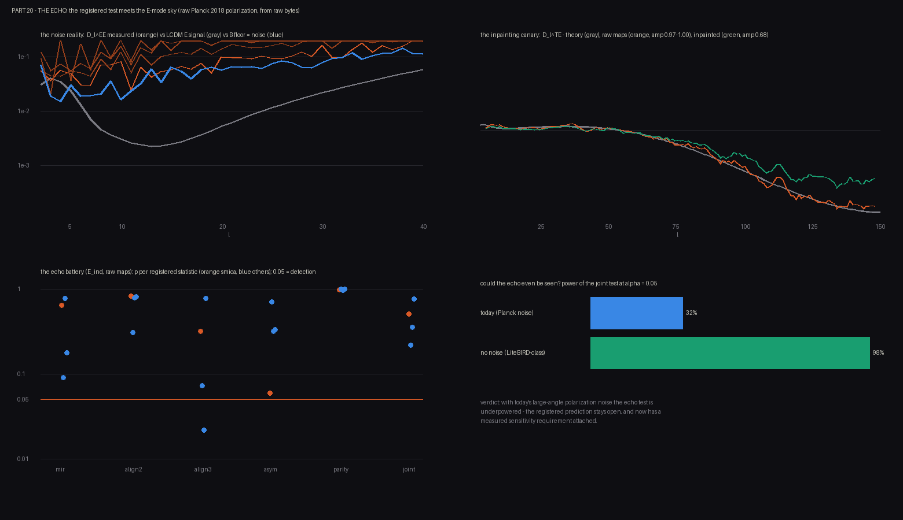

<sub>*The noise reality (E signal drowns below the B floor beyond ℓ≈8), the
inpainting canary, the registered-axis battery, and the power verdict: 32%
today, 98% when LiteBIRD-class data arrives.*</sub>
</div>

— [`echo.py`](echo.py) · polarization reduced by
[`tools/fetch_pol.py`](tools/fetch_pol.py) into
[`data/realsky_pol.npz`](data/realsky_pol.npz)

### 14 · The races the sky already ran

Part 18 (the long-reserved slot) gives the metric its own wave equation — same
lattice, same stencil, same tick as matter — and collects the verdicts reality
has already delivered on the architecture's variants. **The one-cone race**: a
photon and a metric pulse from one event arrive *bit-identically* — one
substrate means one dispersion relation, an identity, not a tuning — while a
deliberately built two-substrate engine (gravity on its own stencil) loses by
half the track. The sky ran this race: GW170817's gamma rays trailed the chirp
by 1.7 s across 40 Mpc, |Δc/c| < 3×10⁻¹⁵ — two-substrate engines dead by
fourteen orders of magnitude. **The polarization race, which our own variant
loses**: a scalar metric strains rulers *along* the wave as much as across it
(measured: longitudinal/transverse = 0.94; GR says 0), and LIGO-Virgo favor
pure tensor — so scalar-metric render gravity is excluded by the real sky,
and the program provably owes a tensor metric. The sky has now executed two
variants (lattice substrate in part 10, scalar metric here); what survives is
sprinkle-like discreteness plus tensor-metric gravity.

<div align="center">
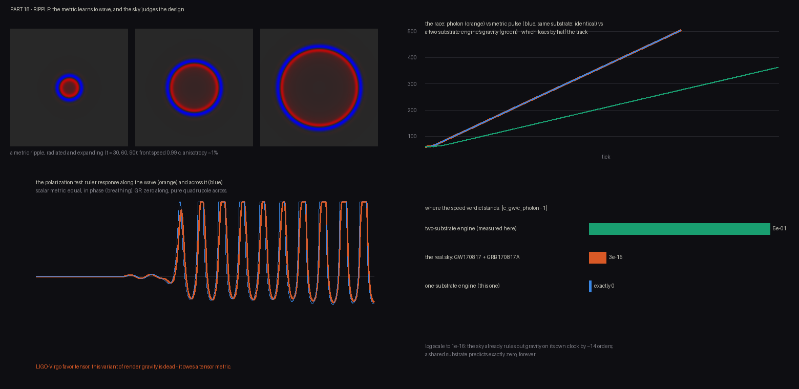

<sub>*A radiated metric ripple (isotropic, speed c); the race — photon and
metric pulse overlapping exactly, the two-substrate engine losing; the
breathing-mode strain that LIGO rules out; and the Δc/c ladder.*</sub>
</div>

— [`ripple.py`](ripple.py)

### 15 · Gravity grows a tensor

Part 18 killed the scalar, so part 21 builds the survivor: linearized tensor
gravity, h<sub>ij</sub> on the lattice — in 3D, because transverse-traceless
waves *don't exist* in two space dimensions. Three measurements, three
verdicts reality already issued. **The ring test**: an arrived wave strains a
ring of test separations in a pure cos 2θ pattern — two polarizations, 45°
apart, traceless, zero longitudinal response — the pattern interferometers
are built around (the scalar's response was all monopole). **The Birkhoff
test**: with matter as an honestly evolving field (stress conserved by
dynamics, not decree), a spherically breathing source leaves the strain
channel silent to machine precision while two colliding packets — the binary
analog — ring it at strain-per-trace efficiency 0.35: monopoles cannot ring
a gravitational-wave detector, which is why the sky's sources are binaries.
**The Eddington test**: with slow matter calibrating Newton (each deflection
minus its zero-gravity control), light on the full tensor metric bends
**1.93×** the Newtonian amount — GR says 2.00, the 1919 eclipse measured it,
Cassini pinned it to 2×10⁻⁵ — and part 16's optical metric stands
retro-diagnosed as Newtonian light.

<div align="center">
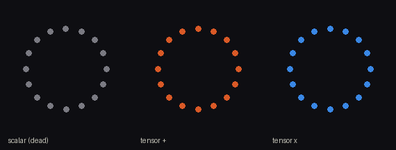

<sub>*The ring of test masses: the dead scalar breathes; the surviving tensor
carries the + and × quadrupole patterns LIGO detects.*</sub>
<br><br>
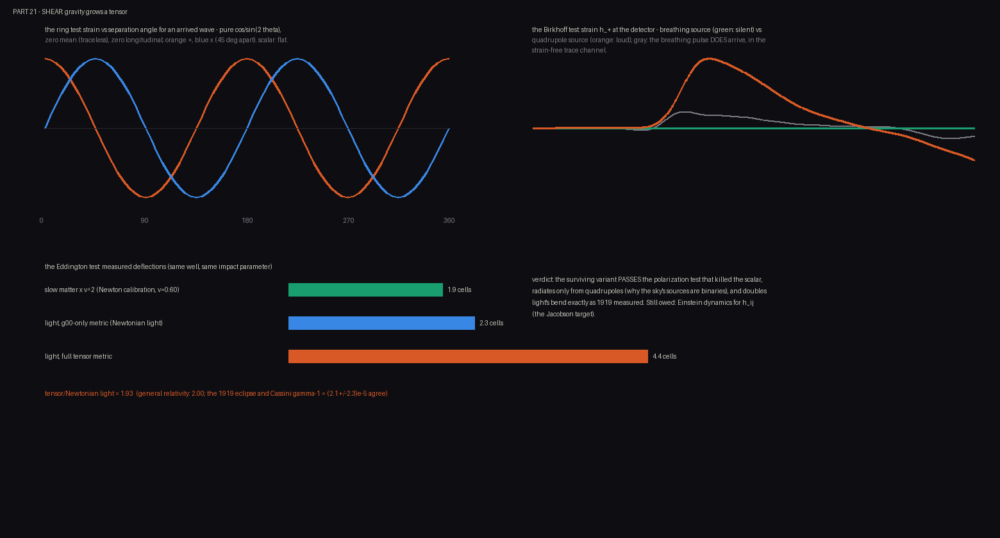

<sub>*The cos 2θ ring response, the silent monopole vs the loud quadrupole,
and the factor-2 light bending.*</sub>
</div>

— [`shear.py`](shear.py)

---

## Every experiment

| Part | Script | The question it asks | Headline result | ~time |
|-----:|--------|----------------------|-----------------|------:|
| 1 | `run.py` | What laws does a physicist confined to pixels discover? | c = 1.000, exact conservation, a particle zoo — and doors in the sky | 15s |
| 2 | `bell.py` | Can chart geometry produce Bell violations? | Pixel CHSH \|S\| = 4; singlet S = 2.84 with no signaling (ER=EPR in 128px) | 6s |
| 3 | `corner.py` | Do structural constraints corner rule space? | 2.1×10¹³ rules → 32; a derived wormhole nobody drew | 7s |
| 3 | `census.py` | Which surviving rules make universes? | 9 of 32 | 6s |
| 3 | `frontier.py` | Does cornering scale with richer alphabets? | 2²⁶ ternary survivors; 83% of samples are universes | 13s |
| 3 | `ledger3d.py` | …and with dimension? | Same 256 states, cube group: 2²⁸ where 2D left 10³³ | 1s |
| 4 | `entangle.py` | Is distance just entanglement? | MI ruler r = 0.986 (scalar), r = 0.61 (fermions); wormhole; tear | 1s |
| 5 | `curve.py` | Does matter curve derived space? | Rulers stretch 2.69×; geodesics bend; a literal funnel | 21s |
| 6 | `tempo.py` | Does the static metric predict dynamics? | Shapiro race confirms; medium gravity violates the EP | 2s |
| 6 | `selfgrav.py` | Can the matter→geometry loop close? | Capture through geometry; area law r = 1.0000 | 1s |
| 7 | `duality.py` | What is wave/particle duality? | Engine wave + render clicks; fringes dot by dot | 1s |
| 8 | `eraser.py` | What is measurement? | V 0.90 → 0.49; record-sorting restores 0.89–0.93 | 8s |
| 9 | `arrow.py` | Where does time's arrow live? | 3,831 → 7,160 bits, exactly reversed; 1-in-2⁴²⁹⁵ seed | 3s |
| 10 | `sprinkle.py` | Can discreteness hide from Lorentz? | Boosted lattice shifts 29%; sprinkle 1% | 15s |
| 10 | `nogo.py` | Where do classical engines die? | 4.8% interference deficit; 2.14×/qubit wall | 8s |
| 10 | `insider.py` | Can an observer be made of pixels? | 21% of collisions leave stable records | 40s |
| 10 | `chiral.py` | Why is the SM hard to host on a lattice? | Fermion doubling watched; Wilson's tradeoff | 1s |
| 11 | `axioms.py` | Can quantum mechanics be cornered? | Complex QM uniquely passes (15 = 15); Born from swaps | 1s |
| 11 | `generation.py` | Can the SM's charges be cornered? | One chiral hypercharge ray; a 5-bit register | 1s |
| 12 | `collider.py` | What is the method itself? | 15 axiom collisions, 12 measured in-repo → [`COLLIDER.md`](COLLIDER.md) | 1s |
| 13 | `fingerprint.py` | Can the universe's seed be detected? | Ceiling ~40 bytes; symmetries survive, statistics launder | 3s |
| 14 | `sky.py` | What should the CMB show, then? | Anomalies jointly p = 4.3×10⁻³; a spectral selection rule | 1s |
| 15 | `renderware.py` | What does quantum computation cost a classical engine? | The smallest engine, not the qubit count | 3s |
| 16 | `universal.py` | Can gravity be universal instead of chromatic? | Metric coupling: achromatic, attractive, Eötvös-passing | 2s |
| 17 | `genesis.py` | Do the three postulates actually run? | Universes from ~50 bytes; space by intervention (r = 0.89) | 5s |
| 18 | `ripple.py` | Can gravity wave — and what does the sky say? | One cone: exact (sky: <3×10⁻¹⁵ ✓); scalar polarization: killed by LIGO | 6s |
| 19 | `firstlight.py` | What does the *real* sky say? | Anomalies reproduced from raw bytes; joint p = 0.003–0.013; no mirror rule | 47s |
| 20 | `echo.py` | Does the signature echo in E-modes? | No echo (p 0.2–0.8) — and none was detectable: power 32% today, 98% at LiteBIRD | 26s |
| 21 | `shear.py` | Can the surviving (tensor) gravity be built? | +/× ring patterns; silent monopole (exact); light bends 1.93× Newton (GR: 2) | 75s |

## Quickstart

Requirements: Python 3.12+, `numpy`, `pillow`. Nothing else. Every experiment is
a standalone script that prints a lab-notebook narrative and writes its figures
and films to [`films/`](films/).

```bash
python3 run.py        # start here: a universe, a firewall, and the doors
python3 genesis.py    # or here: three postulates, universes as output
python3 firstlight.py # the detector battery, pointed at the real CMB
python3 echo.py       # the registered test, asked of E-mode polarization
```

Parts 19–20 run offline from the committed reductions
([`data/realsky_alm.npz`](data/realsky_alm.npz), 100 KB;
[`data/realsky_pol.npz`](data/realsky_pol.npz), 6 MB); to rebuild them from
the raw Planck/WMAP archives (~7 GB, URLs and SHA-256 recorded inside), run
`python3 tools/fetch_sky.py` and `python3 tools/fetch_pol.py`.

## The paper

**[The Rendered Universe (PDF)](writeup/the-rendered-universe.pdf)** — the full
research report: abstract, claim taxonomy, sixteen figures, an
objections-and-replies section, and a reproducibility appendix. The HTML source
is [`writeup/paper.html`](writeup/paper.html).

Claims are classified throughout: **Class A** (measured — novel results of
these toys), **Class B** (known physics reproduced inside the architecture,
with installed components disclosed), **Class C** (conjecture, flagged as
such). What is *not* claimed: QM derived from beneath (Bell and PBR close that
road — it is cornered from axioms instead), the Standard Model derived (its
charges are cornered), or the seed identified (only its class — compressible —
is argued).

## How honest is this?

1. **The epistemic firewall** — observer code cannot import the engine;
   [`tests/test_firewall.py`](tests/test_firewall.py) fails the build otherwise.
2. **Calibrate on a known universe** — every instrument is validated against a
   system whose answer is known before being trusted. Several instruments in
   this program refused to run until their own validators passed.
3. **Installed ≠ emergent** — where quantum statistics were installed rather
   than derived, the code and paper say so plainly.

<details>
<summary><b>Repository layout</b></summary>

```
engine/       the mechanism: reversible block CA (any k-state rule), scalar
              field dynamics, deep matter — knows nothing about screens
render/       the chart: engine → screen projection (identity almost
              everywhere, and that "almost" is the whole story)
physicist/    the observer: forbidden by tests/test_firewall.py from
              importing engine or render — knows only frames
observatory/  research instruments: causal geometry, Gaussian-state
              entanglement, curved-space rulers, spherical harmonics,
              FITS/HEALPix reading and spin-2 (polarization) harmonics
              — all hand-rolled, all validated at import
data/         the real sky, reduced: T and E/B a_lm of Planck 2018 x4
              (+ WMAP9 temperature) with URL + SHA-256 provenance
              (raw FITS not committed)
rulespace/    exact orbit combinatorics over spaces of possible physics
tools/        film generators
films/        every figure and film, regenerated by the scripts
writeup/      the paper (HTML source + PDF)
COLLIDER.md   the axiom collision matrix
```

</details>

## License

MIT — see [`LICENSE`](LICENSE).
